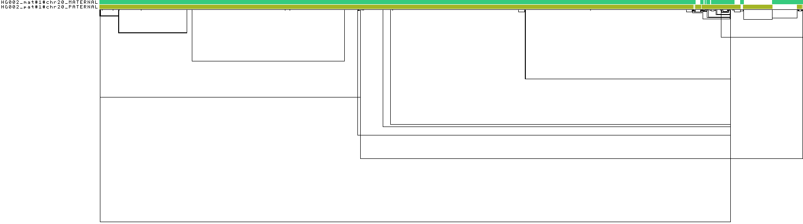
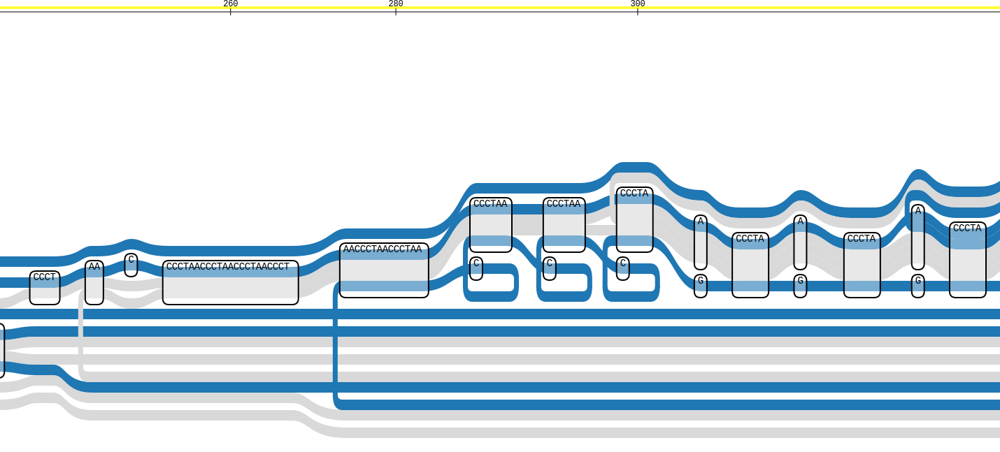

[Home](../README.md)


## HG002 Diploid Pangenome Graph

- versions of tools:

```bash
vg version v1.71.0 "Cera"
Compiled with g++ (Ubuntu 11.4.0-1ubuntu1~22.04) 11.4.0 on Linux
Linked against libstd++ 20230528
Using HTSlib headers 101990, library 1.19.1-29-g3cfe8769
Built by ghickey@mustard

pggb v0.7.4-48-g5134732

odgi v0.9.4-2-g405be8f6
```

### PGGB output: 1D linear pangenome


---

### Sequence Tube Map: Structural variant region


### 0. Download data files
- Mother and father fasta files from the Ashkenazi Jewish family:
```bash
wget https://s3-us-west-2.amazonaws.com/human-pangenomics/T2T/HG002/assemblies/hg002v1.1.mat.fasta.gz
wget https://s3-us-west-2.amazonaws.com/human-pangenomics/T2T/HG002/assemblies/hg002v1.1.pat.fasta.gz
```

### 1. Decompress the files
```bash
gunzip hg002v1.1.mat.fasta.gz
gunzip hg002v1.1.pat.fasta.gz
```
If prefer to keep them compressed, `pggb` can handle `.gz` files directly, but concatenation is trickier. It is recommended to work with uncompressed for simplicity, then re‑compress later if needed.

### 2. Concatenate into one file
```bash
cat hg002v1.1.mat.fasta hg002v1.1.pat.fasta > HG002_diploid.fa
```
This creates a single FASTA file containing both haplotypes.

### 3. Use PanSN‑spec naming
The PanSN‑spec (`sample#haplotype#contig`) helps `pggb` automatically detect haplotypes and assign correct ploidy. The default HG002 headers look like `>chr1` – they don't encode sample or haplotype. To add that information, run:

```bash
# Maternal: use sample name "HG002_mat", haplotype = 1
sed 's/^>/>HG002_mat#1#/' hg002v1.1.mat.fasta > HG002_mat_pansn.fa

# Paternal: use sample name "HG002_pat", haplotype = 1
sed 's/^>/>HG002_pat#1#/' hg002v1.1.pat.fasta > HG002_pat_pansn.fa

# Combine
cat HG002_mat_pansn.fa HG002_pat_pansn.fa > HG002_diploid_pansn.fa
```
Now each header becomes, e.g., `>HG002#1#chr1` (haplotype 1 = maternal) and `>HG002#2#chr1` (haplotype 2 = paternal). With PanSN, `pggb` automatically sets `-n 2`.

### 4. Index the combined FASTA
```bash
samtools faidx HG002_diploid_pansn.fa
```
This creates a `.fai` index file required by `pggb`.

### 5. Test on a single chromosome first
Whole‑genome assemblies are huge (~3 Gbp each). Running on a single chromosome (e.g., chr20) lets verify everything works quickly.

```bash
# check the header name first
grep "^>" HG002_diploid_pansn.fa | head -10

# Extract maternal chr20
samtools faidx HG002_diploid_pansn.fa "HG002_mat#1#chr20_MATERNAL" > chr20_haps.fa

# Append paternal chr20
samtools faidx HG002_diploid_pansn.fa "HG002_pat#1#chr20_PATERNAL" >> chr20_haps.fa

samtools faidx chr20_haps.fa
```
Now use `chr20_haps.fa` as input for a trial run.

### 6. Run pggb
```bash
pggb -i chr20_haps.fa \
     -o pggb_output_chr20 \
     -n 2 -t 16 -p 90 -s 5000 \
     -V 'HG002_mat'   # reference sample (or use full path: 'HG002_mat#1#chr20_MATERNAL')
```
If used PanSN naming, `-n 2` is optional (auto‑detected) two haplotypes.
The `-V 'HG002mat#1#chr20'` tells `pggb` to output a VCF relative to the maternal haplotype as reference.

---

## Sequence Tube Map visualisation

### Step 1: Prepare Graph for Visualization

Sequence Tube Map works best with `vg`-compatible indexed graphs. `pggb` output includes a GFA file (e.g., `*.smooth.final.gfa`). Convert it to a `.vg` graph and create an `.xg` index.

From inside `pggb_output_chr20/` directory:

```bash
# Convert GFA to VG format
vg convert -g pggb_output_chr20/chr20_haps.fa.*.smooth.final.gfa > chr20_graph.vg

# Build the XG index for fast random access
vg index -x chr20_graph.xg chr20_graph.vg

# Create a GBWT haplotype index to see the two haplotypes as colored paths
vg gbwt -G chr20_haps.fa.*.smooth.final.gfa -o chr20_graph.gbwt

# Confrim they contain the haplotypes
vg paths -L -g chr20_graph.gbwt
```

Now have three key files:
- `chr20_graph.vg`
- `chr20_graph.xg`
- `chr20_graph.gbwt`

### Step 2: Place Files in a Data Directory

Sequence Tube Map looks for files in its `dataPath` (default `/data` inside the container). Mount local directory to that path.

Create a directory on host, e.g., `tube-map-data` in the project directory, and copy or symlink the graph files there:

```bash
mkdir tube-map-data
cp chr20_graph.* tube-map-data/
```

> **Note:** The container runs as `node` user (UID 1000). Ensure files are readable. If needed, run `chmod -R 755 ~/tube-map-data`.

### Step 3: Run the Docker Container with Volume Mount

```bash
docker run -it --rm \
  -v ./tube-map-data:/data \
  -p 3000:3000 \
  sktrinh12/sequence-tube-map
```

Now open `http://localhost:3000` in browser.

### Step 4: Load Graph in the UI

1. In the top dropdown, select **"custom (mounted files)"**.
2. Click **"Configure Tracks"** (gear icon).
3. Click the **"+"** button to add a new track.
4. Choose **"graph"** as the track type.
5. In the third dropdown, should see `chr20_graph.xg` (the indexed graph). Select it.
   - If don't see it, make sure the file is in the mounted directory and readable.
6. (Optional) Click the settings icon to assign colors (e.g., `greys` for main palette, `ygreys` for auxiliary paths).
7. Add a second track for haplotypes:
   - Track type: **"haplotype"**
   - File: `chr20_graph.gbwt`
   - Color settings: pick a palette like `blues`
8. Close the track picker.

### Step 5: Enter a Region and View

- In the **"Region"** field, enter coordinates using the **reference path name** as it appears in the graph (e.g., `HG002_mat#1#chr20_MATERNAL:1-10000`).
  - Can find the exact path name by running:  
    `vg paths -L -x chr20_graph.xg`
- Click **"Go"**.

The visualization should appear.

### Pre‑extract Subgraphs for Faster Navigation

For large chromosomes, on‑the‑fly chunk extraction can be slow. Can pre‑compute chunks using `prepare_chunks.sh` and create a BED file for quick jumping. Here's a minimal example (run on host where `vg` is installed):

```bash
cd tube-map-data
./scripts/prepare_chunks.sh \
  -x chr20_graph.xg \
  -h chr20_graph.gbwt \
  -r HG002_mat#1#chr20_MATERNAL:1-500000 \
  -d "chr20 first 500kb" \
  -o chunk_chr20_1_500k \
  >> chr20_chunks.bed
```

Then select that BED file in the UI to see predefined regions.

---
