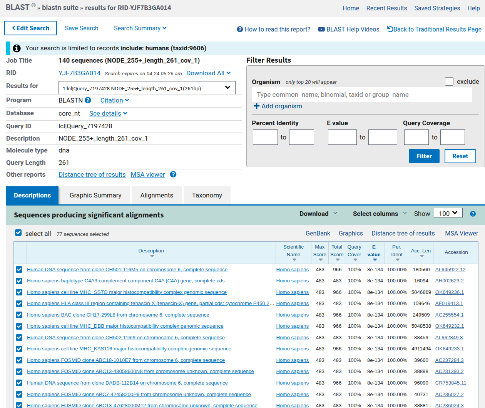

[Home](../README.md)

# MHC/HLA Pangenome Graph Analysis

## Overview
Analysis of the Human MHC locus using chromosome 6 pangenome graphs and the `odgi` toolsuite.

---

### MHC and HLA Biology

The Major Histocompatibility Complex (MHC) is a dense gene region located on chromosome 6 (6p21.3) in humans. This region is critical for the adaptive immune system as it encodes cell surface glycoproteins that present peptide fragments to T-cells. Human Leukocyte Antigens (HLA) are the human version of the MHC, a gene cluster on chromosome 6 encoding cell surface proteins.

#### Key Characteristics

* **Polymorphism:** The MHC is the most polymorphic region in the human genome. This high level of genetic variation ensures that a population can recognize and respond to a vast array of evolving pathogens.
* **Polygeny:** The region contains multiple genes with similar functions, including the HLA-A, HLA-B, and HLA-C (Class I) and HLA-DR, HLA-DQ, and HLA-DP (Class II) loci.
* **Haplotype Inheritance:** MHC alleles are typically inherited together as a block, known as a haplotype.
* **Linkage Disequilibrium:** Due to its density and specific recombination hotspots, certain alleles within the MHC appear together more frequently than expected by chance.

#### Classes of MHC Genes

1.  **Class I:** Found on nearly all nucleated cells. They present endogenous antigens (derived from within the cell, such as viral proteins) to CD8+ cytotoxic T-cells.
2.  **Class II:** Found primarily on professional antigen-presenting cells (APCs) like macrophages and B-cells. They present exogenous antigens (from outside the cell) to CD4+ helper T-cells.
3.  **Class III:** Encodes other immune-related components, including complement proteins and cytokines like Tumor Necrosis Factor (TNF), but does not have antigen-presentation functions.

#### Pangenomic Significance

Because the MHC region is characterized by extreme structural variation, including large insertions, deletions, and gene duplications, a single linear reference genome (like GRCh38) cannot capture the full range of human diversity. Pangenome graphs allow for the representation of these diverse haplotypes simultaneously, facilitating more accurate alignment and variant calling in immunological research.

---

### 2D Draw output of MHC region


### PGGB output: 1D linear pangenome graph


---

## Data Preparation
1. Download the chromosome 6 pangenome graph in GFA format:
   `wget https://s3-us-west-2.amazonaws.com/human-pangenomics/pangenomes/scratch/2021_11_16_pggb_wgg.88/chroms/chr6.pan.fa.a2fb268.4030258.6a1ecc2.smooth.gfa.gz`
2. Decompress the file:
   `gunzip chr6.pan.fa.a2fb268.4030258.6a1ecc2.smooth.gfa.gz`
3. Build the `odgi` graph:
   `odgi build -g chr6.pan.fa.a2fb268.4030258.6a1ecc2.smooth.gfa -o chr6.pan.og -t 8 -P`

## Subgraph Extraction
Extract the MHC region based on HLA gene coordinates from a BED file:

```bash
# download the bed file
curl -L -o chr6.HLA_genes.bed https://github.com/pangenome/odgi/raw/master/test/chr6.HLA_genes.bed

# extract and generate the og file
odgi extract -i chr6.pan.og -o chr6.pan.MHC.og -b chr6.HLA_genes.bed -c 0 -E -t 8 -P
```

## Statistics and Path Validation
1. Calculate path statistics:
   `odgi stats -i chr6.pan.MHC.og -S`
2. Count contigs per haplotype to identify fragmentation:
   `odgi paths -i chr6.pan.MHC.og -L | cut -d'#' -f 1,2 | uniq -c | sort -nr`

**Theoretical Expectation:**
A fully resolved MHC locus for this dataset (44 diploid individuals and 2 haploid references) should contain 90 paths. Higher counts indicate assembly fragmentation where a single haplotype is represented by multiple contigs.

## Visualization and Layout
1. **1D Visualization:** Sort the graph to linearize nodes and visualize path relationships:
   `odgi sort -i chr6.pan.MHC.og -o - -O | odgi viz -i - -o chr6.pan.MHC.png -s '#' -a 20`
   *Sorting is required to organize nodes logically according to genomic sequence similarity, reducing visual noise.*
   * count number of paths extracted from subgraph: `odgi paths -i chr6.pan.MHC.og -L | wc -l`
   * Expected number if the MHC locus were solved with a single contig per haplotype: would expect 90 paths, corresponding to the 90 haplotypes (44 diploid samples × 2 haplotypes = 88 haplotypes plus 2 haploid references)
   * use `odgi paths -i chr6.pan.MHC.og -L | awk -F'#' '{print $1}' | sort | uniq -c` in order where any sample with a count greater than 1 indicates that the MHC locus is represented by multiple contigs for that haplotype
    * The MHC locus is known to be highly polymorphic with complex structural variations, including copy number variations and segmental duplications, which can cause the pangenome graph builder to represent the region using multiple contigs for some haplotypes

2. **2D Layout:** Generate a force-directed layout:
   `odgi sort -i chr6.pan.MHC.og -o - -O | odgi layout -i - -o chr6.pan.MHC.lay -T chr6.pan.MHC.tsv -t 8 -P`

3. **Rendering:** Draw the layout to visualize graph topology:
   `odgi sort -i chr6.pan.MHC.og -o - -O | odgi draw -i - -c chr6.pan.MHC.lay -p chr6.pan.MHC.draw.png -t 8`

## Sequence Tube map

- Identify nodes for visualisation
    * first check the `chr6.pan.MHC.png` and notice the right hand side region with a messy and pixilated range; this will be the region of interest
    * based on the paths listed in the grch38 above the chm13 path and lining up the bp's from grch38 to that of chm13, the labeled ranges are around 29592417-32911085

```bash
odgi paths -i chr6.pan.MHC.og -L
odgi sort -i chr6.pan.MHC.og -o - -O | odgi pathindex -i - -o chr6.pan.MHC.xp

# locate a specific nucleotide position (e.g., 32628177) on the CHM13 path
odgi panpos -i chr6.pan.MHC.xp -p "chm13#chr6:29592417-32911085" -n 3035760

# verify Node ID by viewing a small slice of the graph.
odgi sort -i chr6.pan.MHC.og -o - -O | odgi extract -i - -r "chm13#chr6:29592417-32911085:3035760-3035860" -o spot_check.og

# use the output of this in STM
odgi view -i spot_check.og -g | grep "^S" | awk '{print $2}'
```

- generated the `.xg` and `.gbwt` files for STM:
    * from the output of the last command, use a +500 basepair to confine the range

```bash
odgi view -i chr6.pan.MHC.og -g > chr6.pan.MHC.gfa

# convert to xg and gbwt for sequence tube map
vg convert -g chr6.pan.MHC.gfa > chr6.pan.MHC.vg
vg index -x chr6.pan.MHC.xg chr6.pan.MHC.vg
vg gbwt -G chr6.pan.MHC.gfa -o chr6.pan.MHC.gbwt
```

---

## Complement Component 4 (C4)


**Overview:**
The MHC locus includes the complement component 4 (C4) region, which encodes proteins involved in the complement system. In humans, the C4 gene exists as 2 functionally distinct genes, C4A and C4B, which both vary in structure and copy number. Moreover, C4A and C4B genes segregate in both long and short genomic forms, distinguished by the presence or absence of a human endogenous retroviral (HERV) sequence.

**Find C4 coordinates:**

```bash
# Download chromosome size file (needed for bedtools slop to avoid extending coordinates beyond chromosome boundaries)
wget http://hgdownload.soe.ucsc.edu/goldenPath/hg38/bigZips/hg38.chrom.sizes

# Download NCBI RefSeq gene annotations for hg38. Retrieves gene models including exon/intron boundaries and gene names
wget https://hgdownload.soe.ucsc.edu/goldenPath/hg38/bigZips/genes/hg38.ncbiRefSeq.gtf.gz

# Extract and merge C4A/C4B genomic intervals
zgrep 'gene_id "C4A"\|gene_id "C4B"' hg38.ncbiRefSeq.gtf.gz |
  awk '$1 == "chr6"' | cut -f 1,4,5 |
  bedtools sort | bedtools merge -d 15000 | bedtools slop -l 10000 -r 20000 -g hg38.chrom.sizes |
  sed 's/chr6/grch38#chr6/g' > hg38.ncbiRefSeq.C4.coordinates.bed
```

- `zgrep`: Extracts all lines for C4A or C4B genes from the compressed GTF.
- `awk '$1 == "chr6"'`: Keeps only chromosome 6 entries.
- `cut -f 1,4,5`: Retains chromosome, start, end positions.
- `bedtools sort`: Sorts intervals by chromosome and start position.
- `bedtools merge -d 15000`: Merges overlapping or nearby intervals (≤15 kb apart) into single regions – this accounts for multiple exons/transcripts of the same gene.
- `bedtools slop -l 10000 -r 20000`: Extends each merged interval 10 kb upstream and 20 kb downstream to include flanking regulatory regions.
- `sed 's/chr6/grch38#chr6/g'`: Renames chromosome to match PGGB path naming convention (grch38#chr6).

**Extract the C4 locus:**

```bash
odgi extract -i chr6.pan.og -b hg38.ncbiRefSeq.C4.coordinates.bed -o - -c 0 -E -t 8 -P |
  odgi explode -i - --biggest 1 --sorting-criteria P --optimize -p chr6.pan.C4

odgi sort -i chr6.pan.C4.0.og -o chr6.pan.C4.sorted.og -p Ygs -x 100 -t 8 -P
```

- `odgi` extract: Pulls out the subgraph covering the C4 coordinates (plus flanking regions due to -E). Decomposes a pangenome graph into its connected components (disjoint subgraphs that are not linked by any path or edge).
- `-o -`: Writes output to stdout (pipe).
- `-c 0`: No extra context padding (already added by slop).
- `-E`: Includes all nodes between min/max touched positions from any path.
- `-t 8, -P:` 8 threads, show progress.
- `| odgi explode:` Takes the extracted subgraph and splits it into connected components. Here --biggest 1 keeps only the largest component (likely the true C4 locus), discarding small unconnected pieces.
- `--sorting-criteria P`: Uses path-guided sorting to order nodes within the component.
- `--optimize`: Tries to reduce graph complexity (e.g., removing redundant edges).
- `-p chr6.pan.C4`: Prefix for output files (chr6.pan.C4.0.og, chr6.pan.C4.1.og, …). Only the first (0) is kept.


```bash
odgi paths -i chr6.pan.C4.sorted.og  -L | grep 'chr6\|HG00438\|HG0107\|HG01952' > chr6.selected_paths.txt
```

- `-p Ygs`: Sorts nodes by Y (path-guided layout), then g (path-guided grouping), then s (stable sort). This produces a linear ordering that reflects the consensus path.
- `-x 100`: Adds 100 bp of extra padding at both ends of the graph to avoid edge effects.
- `-t 8, -P:` 8 threads, progress.

**Visualise the components:**

```bash
# odgi viz: default (binned) mode
odgi viz -i chr6.pan.C4.sorted.og -o chr6.pan.C4.sorted.png -c 12 -w 100 -y 50 -p chr6.selected_paths.txt

# odgi viz: color by strand
odgi viz -i chr6.pan.C4.sorted.og -o chr6.pan.C4.sorted.z.png -c 12 -w 100 -y 50 -p chr6.selected_paths.txt -z

# odgi viz: color by position
odgi viz -i chr6.pan.C4.sorted.og -o chr6.pan.C4.sorted.du.png -c 12 -w 100 -y 50 -p chr6.selected_paths.txt -du

# odgi viz: color by depth
odgi viz -i chr6.pan.C4.sorted.og -o chr6.pan.C4.sorted.m.png -c 12 -w 100 -y 50 -p chr6.selected_paths.txt -m -B Spectral:4
```

`chr6.pan.C4.sorted.m.png` image provides a visual representation of structural variation and copy number differences across the selected haplotypes in the C4 region. This highlights which parts are conserved (depth 1) and polymorphic (depth ≥2).

```bash
# generate a list of all paths
odgi paths -i chr6.pan.C4.sorted.og -L > all_paths.txt
# visualize all haplotypes coloring by depth
odgi viz -i chr6.pan.C4.sorted.og -o chr6.pan.C4.all.png -c 12 -w 100 -y 50 -p all_paths.txt -m -B Spectral:4 -t 8 -P

# generate tsv depth file
# The TSV confirms its exceptional length (end = 103,602 vs. typical 77–84 kb)
# and higher mean depth (152.5 vs. ~134–146), consistent with an extra copy.
odgi depth -i chr6.pan.C4.sorted.og > depth_output.tsv

# count number of haplotypes are missing the HERV sequence
awk '$3 ~ /^772[0-9]{2}/' depth_output.tsv | wc -l

# generate layout with odgi layout
odgi layout -i chr6.pan.C4.sorted.og -o chr6.pan.C4.lay -T chr6.pan.C4.tsv -t 8 -P

# can see the tangle loop more easily
odgi draw -i chr6.pan.C4.sorted.og -c chr6.pan.C4.lay -p chr6.pan.C4.draw.png -t 8 -P

# open with bandage
odgi view -i chr6.pan.C4.sorted.og -g > chr6.pan.C4.gfa
```

- All haplotypes whose path length is ~77.2 kb (instead of ~83.6 kb) lack the ~6.4 kb HERV insertion.
    * From the TSV, these include (among others):
        * `HG00621#1, HG00673#2, HG00735#1, HG00735#2, HG00741#1, HG00741#2, HG01071#1, HG01109#2, HG01175#2, HG01243#2, HG01258#2, HG01358#2, HG01361#2, HG01891#2`
- Bubble formation: The HERV insertion creates a "bubble" in the graph—a region where haplotypes diverge into two parallel paths: one representing the sequence with the HERV (long form) and one without it (short form). These alternative alleles converge at the boundaries of the insertion site

---

## BLAST graph results

First, download the `.fna` file from [C4A complement](https://www.ncbi.nlm.nih.gov/gene/?term=NM_007293). Then click 'Create/view BLAST search', and load the `.fna` file.

**BLAST interpretation.** The query (human MHC C4A region, chr6:31,982,057‑32,002,681) was aligned to the assembly graph (GFA) using BLAST without filters. The results show hundreds of high‑identity (≥90‑100%) alignments, but most are short (<750 bp, covering <4% of the query each). This pattern is characteristic of a repeat‑rich genomic region: the C4A gene contains many intragenic Alu elements and is embedded in the RP‑C4 segmental duplication (C4A/C4B paralogues). Consequently, each short repeat copy aligns to multiple graph nodes (or to multiple positions within the same node), explaining the large number of hits. The near‑perfect matches with e‑value = 0 correspond to nearly identical repetitive elements, while lower‑identity hits (91‑98%) represent diverged copies or allelic differences. These results are expected for the MHC and do not indicate assembly errors; rather, they highlight the need for repeat‑masking or longer alignment filters when analyzing unique genic regions.

- Can filter based on bp length and other params, copy paste output by selecting manually. Also can use the version of BLAST by clicking 'Output' -> 'Web BLAST selected nodes' as shown below:


