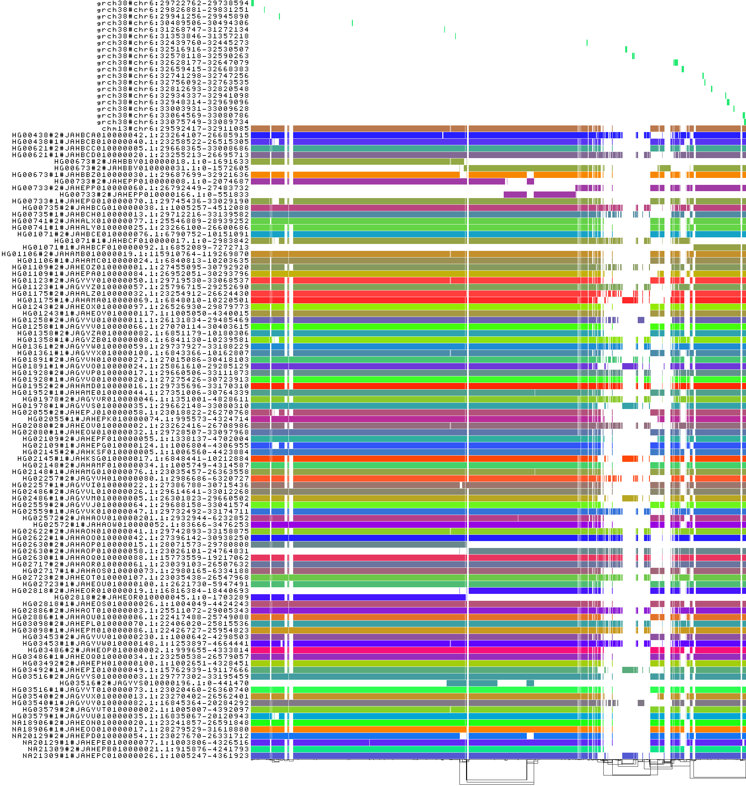

[Home](../README.md)

# MHC/HLA Pangenome Graph Analysis

## Overview
Analysis of the Human MHC locus using chromosome 6 pangenome graphs and the `odgi` toolsuite.

---

### MHC and HLA Biology

The Major Histocompatibility Complex (MHC) is a dense gene region located on chromosome 6 (6p21.3) in humans. This region is critical for the adaptive immune system as it encodes cell surface glycoproteins that present peptide fragments to T-cells. Human Leukocyte Antigens (HLA) are the human version of the MHC, a gene cluster on chromosome 6 encoding cell surface proteins.

#### Key Characteristics

* **Polymorphism:** The MHC is the most polymorphic region in the human genome. This high level of genetic variation ensures that a population can recognize and respond to a vast array of evolving pathogens.
* **Polygeny:** The region contains multiple genes with similar functions, including the HLA-A, HLA-B, and HLA-C (Class I) and HLA-DR, HLA-DQ, and HLA-DP (Class II) loci.
* **Haplotype Inheritance:** MHC alleles are typically inherited together as a block, known as a haplotype.
* **Linkage Disequilibrium:** Due to its density and specific recombination hotspots, certain alleles within the MHC appear together more frequently than expected by chance.

#### Classes of MHC Genes

1.  **Class I:** Found on nearly all nucleated cells. They present endogenous antigens (derived from within the cell, such as viral proteins) to CD8+ cytotoxic T-cells.
2.  **Class II:** Found primarily on professional antigen-presenting cells (APCs) like macrophages and B-cells. They present exogenous antigens (from outside the cell) to CD4+ helper T-cells.
3.  **Class III:** Encodes other immune-related components, including complement proteins and cytokines like Tumor Necrosis Factor (TNF), but does not have antigen-presentation functions.

#### Pangenomic Significance

Because the MHC region is characterized by extreme structural variation, including large insertions, deletions, and gene duplications, a single linear reference genome (like GRCh38) cannot capture the full range of human diversity. Pangenome graphs allow for the representation of these diverse haplotypes simultaneously, facilitating more accurate alignment and variant calling in immunological research.

---

### 2D Draw output of MHC region


### PGGB output: 1D linear pangenome graph



---

## Data Preparation
1. Download the chromosome 6 pangenome graph in GFA format:
   `wget https://s3-us-west-2.amazonaws.com/human-pangenomics/pangenomes/scratch/2021_11_16_pggb_wgg.88/chroms/chr6.pan.fa.a2fb268.4030258.6a1ecc2.smooth.gfa.gz`
2. Decompress the file:
   `gunzip chr6.pan.fa.a2fb268.4030258.6a1ecc2.smooth.gfa.gz`
3. Build the `odgi` graph:
   `odgi build -g chr6.pan.fa.a2fb268.4030258.6a1ecc2.smooth.gfa -o chr6.pan.og -t 8 -P`

## Subgraph Extraction
Extract the MHC region based on HLA gene coordinates from a BED file:

```bash
# download the bed file
curl -L -o chr6.HLA_genes.bed https://github.com/pangenome/odgi/raw/master/test/chr6.HLA_genes.bed

# extract and generate the og file
odgi extract -i chr6.pan.og -o chr6.pan.MHC.og -b chr6.HLA_genes.bed -c 0 -E -t 8 -P
```

## Statistics and Path Validation
1. Calculate path statistics:
   `odgi stats -i chr6.pan.MHC.og -S`
2. Count contigs per haplotype to identify fragmentation:
   `odgi paths -i chr6.pan.MHC.og -L | cut -d'#' -f 1,2 | uniq -c | sort -nr`

**Theoretical Expectation:**
A fully resolved MHC locus for this dataset (44 diploid individuals and 2 haploid references) should contain 90 paths. Higher counts indicate assembly fragmentation where a single haplotype is represented by multiple contigs.

## Visualization and Layout
1. **1D Visualization:** Sort the graph to linearize nodes and visualize path relationships:
   `odgi sort -i chr6.pan.MHC.og -o - -O | odgi viz -i - -o chr6.pan.MHC.png -s '#' -a 20`
   *Sorting is required to organize nodes logically according to genomic sequence similarity, reducing visual noise.*

2. **2D Layout:** Generate a force-directed layout:
   `odgi sort -i chr6.pan.MHC.og -o - -O | odgi layout -i - -o chr6.pan.MHC.lay -T chr6.pan.MHC.tsv -t 8 -P`

3. **Rendering:** Draw the layout to visualize graph topology:
   `odgi sort -i chr6.pan.MHC.og -o - -O | odgi draw -i - -c chr6.pan.MHC.lay -p chr6.pan.MHC.draw.png -t 8`

